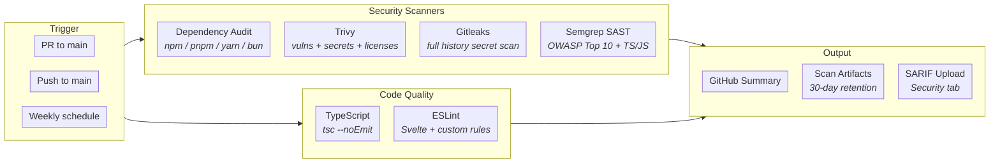
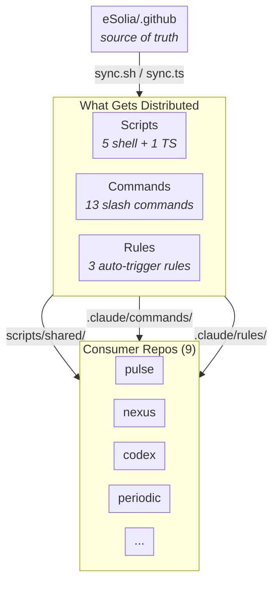

# eSolia `.github` Repository

This is eSolia's [special GitHub organization repository](https://docs.github.com/en/organizations/collaborating-with-groups-in-organizations/customizing-your-organizations-profile). It serves three purposes:

1. **Organization profile README** — the `profile/README.md` file is displayed on [github.com/eSolia](https://github.com/eSolia). It's generated dynamically using [Lume](https://lume.land/) and rebuilt daily via GitHub Actions.

2. **Shared workflows** — reusable, hardened CI/CD workflows that any eSolia repository can reference with a single line.

3. **Centralized developer infrastructure** — shared scripts, Claude Code commands, and Claude Code rules distributed to all eSolia repositories via a sync mechanism.

## CI/CD Security Hardening

All GitHub Actions workflows in this org follow a hardened security posture. These measures were applied across all eSolia repositories in March 2026.

### Hardening Measures

| Measure | Status | Detail |
|---------|--------|--------|
| SHA pinning | All actions pinned to full 40-char commit hashes with version comments |
| Node 24 runtimes | All actions upgraded to latest Node 24 runtime versions |
| Least-privilege permissions | Workflow-level `contents: read`, job-level overrides only where needed |
| Credential isolation | `persist-credentials: false` on all checkout steps (except where push is required) |
| Injection prevention | No `${{ }}` expressions in `run:` blocks — all values flow through `env:` |
| CODEOWNERS | `.github/`, `package.json`, lockfiles require security team review |
| Secret scanning | Multi-layer: Gitleaks + Trivy + Semgrep |

### Security Scanning Pipeline

Any eSolia repo can adopt the full scanning pipeline with a single workflow reference:

```yaml
jobs:
  security:
    uses: eSolia/.github/.github/workflows/security.yml@main
```



### Wrangler Config QC

A separate reusable workflow validates Cloudflare Worker configurations on every PR:

```yaml
jobs:
  qc:
    uses: eSolia/.github/.github/workflows/qc-wrangler.yml@main
```

Checks: JSONC format enforcement, `account_id` presence, `compatibility_date` freshness (configurable, default 30 days), observability config.

### Audit & Hardening Commands

Two Claude Code slash commands (distributed via sync) provide interactive security auditing:

- **`/security:audit-github-actions`** — Comprehensive audit of all workflow files in a repo. Checks SHA pinning, permissions, dangerous triggers, script injection, credential persistence, runner security, secrets handling, and branch protection. Uses [zizmor](https://github.com/woodruffw/zizmor), [actionlint](https://github.com/rhysd/actionlint), and [pinact](https://github.com/suzuki-shunsuke/pinact) when available. Writes a structured report to `docs/`.

- **`/security:harden-github-org`** — Two-phase command (audit then interactive apply) for GitHub org and repo settings. Covers base permissions, 2FA enforcement, Actions allowlists, repo feature flags, branch rulesets, Dependabot, CODEOWNERS, and SECURITY.md. Every change requires explicit confirmation with impact notes.

Both commands pull the hardening reference guide from the eSolia standards MCP (`github-actions-security-hardening` slug).

## Shared Infrastructure

Every eSolia repository can pull centralized scripts, Claude Code slash commands, and Claude Code rules from this repo. Run the sync once and everything is set up — thin wrapper scripts, commands, and rules all land in the right places.

### What Gets Synced

**Scripts** (to `scripts/shared/`, with thin wrappers in `scripts/`):

| Script | Purpose |
|--------|---------|
| `bump-version.sh` | Version bump with wrangler QC checks |
| `update-wrangler.sh` | PM-agnostic wrangler updater |
| `audit-backpressure.sh` | SvelteKit quality audit across repos |
| `sync.sh` | Re-sync everything (bash) |
| `sync.ts` | Re-sync everything (cross-platform TypeScript) |
| `submit-bing.mts` | Bing Webmaster URL submission (any site) |

**Claude Code Commands** (to `.claude/commands/`):

| Command | Description |
|---------|-------------|
| `/backpressure-review` | Deep SvelteKit quality review |
| `/seo-setup` | SEO checklist and setup |
| `/checkpoint` | Save session checkpoint to `docs/checkpoints/` |
| `/commit-style` | Conventional commit and InfoSec reference |
| `/dev:d1-health` | Cloudflare D1 database health audit |
| `/dev:preflight` | Show preflight checks for current project |
| `/dev:svelte-review` | Review code against Svelte 5 best practices |
| `/security:audit-github-actions` | GitHub Actions security audit |
| `/security:harden-github-org` | GitHub org and repo hardening |
| `/standards:check` | Review code against eSolia coding standards |
| `/standards:list` | List all eSolia standards |
| `/standards:search` | Search standards by keyword |
| `/standards:writing` | Review content against eSolia writing guides |

**Claude Code Rules** (to `.claude/rules/`):

| Rule | Triggers On |
|------|-------------|
| `backpressure-verify` | SvelteKit code changes — auto-runs verify |
| `d1-maintenance` | D1/wrangler/schema files — enforces indexing and query practices |
| `mermaid-diagrams` | Markdown/mermaid files — enforces compact styling |

### Sync Distribution Architecture



### Quick Start

**macOS / Linux / WSL:**

```bash
curl -sSfL https://raw.githubusercontent.com/eSolia/.github/main/scripts/sync.sh | bash
```

**Any platform (with Node.js):**

```bash
npx tsx https://raw.githubusercontent.com/eSolia/.github/main/scripts/sync.ts
```

Or from within a repo that has already been synced:

```bash
./scripts/shared/sync.sh                # bash
npx tsx scripts/shared/sync.ts          # cross-platform
```

### Options

```
--check          Check if scripts are up-to-date (exit 1 if stale)
--ref <tag|sha>  Pin to a specific git ref (default: main)
--scripts-only   Only sync scripts (skip commands and rules)
```

### How It Works

1. Downloads scripts from this repo into `scripts/shared/` (gitignored)
2. Creates thin wrapper scripts in `scripts/` that delegate to `scripts/shared/`
3. Downloads Claude commands into `.claude/commands/`
4. Downloads Claude rules into `.claude/rules/`
5. Writes a `.scriptversion` file for staleness checking
6. Adds `scripts/shared/` to `.gitignore` if not already there

The wrapper pattern means your repo only commits the 4-line wrapper, not the full script. Updates flow through `sync.sh`/`sync.ts`.

## Windows Setup

The TypeScript sync script (`sync.ts`) works natively on Windows. You need Node.js and `tsx`.

### Install Node.js

Download from [nodejs.org](https://nodejs.org/) (LTS recommended), or use a version manager:

```powershell
# Option 1: winget (built into Windows 11)
winget install OpenJS.NodeJS.LTS

# Option 2: fnm (fast Node manager — recommended for switching versions)
winget install Schniz.fnm
fnm install --lts
fnm use lts-latest

# Option 3: Chocolatey
choco install nodejs-lts
```

### Install tsx

`tsx` runs TypeScript files directly without a build step. It's used via `npx` (bundled with Node.js), so no global install is needed — `npx tsx` downloads it on first use.

If you prefer a global install for speed:

```powershell
npm install -g tsx
```

### Run the sync

```powershell
# From any eSolia repo directory:
npx tsx https://raw.githubusercontent.com/eSolia/.github/main/scripts/sync.ts

# Or after first sync:
npx tsx scripts\shared\sync.ts
```

The bash scripts (`bump-version.sh`, etc.) require Git Bash or WSL on Windows. The sync itself works without either.

## How the Profile README Works

A [Vento](https://vento.js.org/) template (`src/repo-readme.vto`) pulls live data at build time:

- **Blog posts** from [blog.esolia.pro](https://blog.esolia.pro) JSON feeds (English + Japanese)
- **Japanese holidays** from [holidays-jp](https://holidays-jp.github.io/api/v1/date.json)
- **Build metadata** (Lume/Deno/V8 versions, repo size)

The Lume build generates `_site/repo-readme.md`, which a post-build script copies to `profile/README.md`. A GitHub Actions workflow runs this daily at 16:30 UTC and on every push.

## Profile README Development

```bash
# Install Deno: https://deno.land
deno task serve   # Preview at http://localhost:3000
deno task build   # Build once
```

## Repository Structure

```
.claude/
  shared-commands/          # Source of truth for Claude commands
    dev/                    #   /dev:* commands
    security/               #   /security:* commands
    standards/              #   /standards:* commands
  shared-rules/             # Source of truth for Claude rules
.github/
  workflows/
    security.yml            # Reusable security scanning (7 scanners)
    qc-wrangler.yml         # Reusable wrangler config QC
    update-profile-readme.yml # Daily profile rebuild + auto-commit
  CODEOWNERS                # Security team review for .github/ and deps
scripts/
  lib/common.sh             # Shared library (PM detection, colors)
  bump-version.sh           # Version bump + wrangler QC
  update-wrangler.sh        # PM-agnostic wrangler updater
  audit-backpressure.sh     # SvelteKit quality audit
  sync.sh                   # Sync script (bash)
  sync.ts                   # Sync script (TypeScript, cross-platform)
  submit-bing.mts           # Bing Webmaster URL submission
src/
  _data.ts                  # Data fetching (blog feeds, holidays)
  repo-readme.vto           # Vento template for profile README
profile/
  README.md                 # Generated output (do not edit directly)
SECURITY.md                 # Vulnerability disclosure policy
```

## License

MIT
