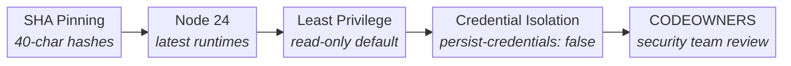
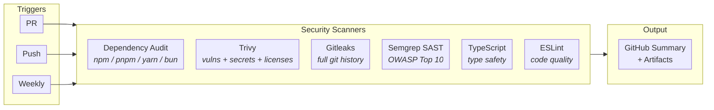

[](https://proven.lol/fbd788)

**Last Updated:** April 13th, 2026 at 1:44:09 AM GMT+9 &nbsp; **Today is:** Tuesday, April 14, 2026


## Welcome 👋

We're eSolia — a Tokyo-based IT consultancy that builds software. Since 1999, we've helped international companies navigate Japan's business technology landscape, and along the way, we've developed serious software engineering capabilities.

This GitHub profile is where we share our work: internal tools that solve real problems for our clients, and open-source utilities that might help you too.

## What We're Building

We develop business software focused on **security**, **compliance**, and **operational visibility** for international companies in Japan.

| Product | Purpose | Stack |
|---------|---------|-------|
| **Nexus** | Central platform hub — OAuth provider, secure file sharing with provenance, unified client management across all apps | Hono, Cloudflare Workers, D1, R2, Queues |
| **Pulse** | Compliance dashboard for SOC 2, ISO 27001, PCI-DSS — accumulates evidence against vetted control lists with secure, shareable executive reports | SvelteKit, Cloudflare Pages, D1, R2 |
| **Periodic** | DNS drift monitoring and alerting — detects unauthorized changes before they become security incidents | SvelteKit, Cloudflare Pages, D1 |
| **Courier** | Desktop secure file sharing — PIN-protected document delivery with BCC-trigger workflow for frictionless sharing | SvelteKit, Cloudflare Pages |
| **Chōchō** | ESL listening comprehension trainer — pre-generated multi-accent TTS audio for Japanese staff preparing for international calls | SvelteKit PWA, Cloudflare Pages, D1, R2 |
| **Codex** *(coming soon)* | Unified knowledge infrastructure — single source of truth with dual authoring (CMS for staff, Git for power users), AI-powered RAG search, and SharePoint integration. Ask Miko (巫女) | SvelteKit, Cloudflare Pages, D1, R2 |

All apps emphasize **physical data isolation per client** — we don't do shared databases with logical separation for compliance-grade applications. Nexus provides **single sign-on** across the suite via OAuth2/OIDC with Microsoft 365 SSO and magic link authentication.

## Our Stack

We build primarily on **Cloudflare's platform** (Workers, Pages, D1, R2, Queues) for its compelling security-to-cost ratio: enterprise-grade edge security, DDoS protection, and WAF capabilities without enterprise pricing. For applications requiring Deno KV's strong consistency model, we deploy to **Deno Deploy**.

### Core Principles

| Principle | Policy |
|---------|---------|
| **OWASP Top 10** | → Every project, every review: Compliance-grade applications must adhere to the OWASP Top 10 security risks. |
| **ISO 27001** | → Incorporated into dev practices for comprehensive security management. |
| **Defense in depth** | → Multiple security layers, not one wall. |
| **Continuous Integration/Continuous Deployment (CI/CD)** | → Automated testing and deployment pipelines ensure quality and security. |
| **Security by Design** | → Security is integrated into the design and development process. |
| **Security Automation** | → Automated security tools and processes for faster response and prevention. |
| **Security Awareness Training** | → Regular training for developers and users to understand and mitigate security risks. |
| **Security Monitoring** | → Continuous monitoring for threats and anomalies. |
| **Edge-first** | → Security and performance at the edge. |
| **Zero Trust** | → Trust no one, verify everything. |

### Technologies

<div align="center">

**Languages & Frontend**


**Platforms & Runtime**


**Tools & Environment**


</div>

## Security Practices

We incorporate **ISO 27001:2022** good practices into our development work, backed by automated security scanning in CI/CD. In March 2026, we completed a comprehensive hardening initiative across all repositories.

### CI/CD Hardening

All GitHub Actions workflows across eSolia repositories follow a hardened security posture:



| Measure | Detail |
|---------|--------|
| **SHA pinning** | All third-party actions pinned to full commit hashes — no mutable tags |
| **Node 24 runtimes** | `actions/checkout@v6`, `actions/setup-node@v6`, `codeql-action@v4` |
| **Least-privilege permissions** | Workflow-level `contents: read`; write access only per-job where needed |
| **Credential isolation** | `persist-credentials: false` on all checkout steps |
| **Injection prevention** | No dynamic context expressions in `run:` blocks — values flow through `env:` |
| **CODEOWNERS** | `.github/`, `package.json`, lockfiles require `@eSolia/security-reviewers` approval |

### Centralized Security Scanning

We maintain a **reusable security workflow** ([`security.yml`](.github/workflows/security.yml)) that runs OWASP-aligned checks across all repositories on every PR, push to main, and weekly:



Any repository can adopt this workflow with minimal configuration:

```yaml
jobs:
  security:
    uses: eSolia/.github/.github/workflows/security.yml@main
```

<details>
<summary><strong>ISO 27001:2022 Annex A Control 8.25 Compliance</strong></summary>

| Requirement | How We Address It |
|-------------|-------------------|
| Separate dev, test, and production environments | Local development → protected preview branches → production. For PROdb, combined dev/test environments merge to production after approval. |
| Security guidance in SDLC | Handled via SOP with OWASP Top 10 as baseline for every project. |
| Security requirements in design phase | Every project specifies security requirements during initial specification. |
| Security checkpoints in projects | Security framework established in spec → developed per guidelines → security implementation reported. |
| Security and system testing | Security header validation for websites. Platform vendor penetration testing plus our checks on table, view, and form security for database projects. |
| Secure source code repositories | Write permissions (commit/merge) restricted to permitted personnel only. |
| Version control security | Change management process explicitly considers version control security. |
| Developer security knowledge | Ongoing training and knowledge development program. |
| Flaw recognition capability | Active effort to understand and identify security weaknesses in our work. |
| Licensing compliance | Full awareness and adherence to all licensing requirements. |

</details>

## Latest from Our Blog

### English


- [Let’s share your data using OneDrive!](https://blog.esolia.pro/en/posts/2026406-using-onedrive-en/) — _This article clearly explains how to securely and easily share files using Microsoft 365 OneDrive...._

- [Introducing Acrobat Standard features for use in administrative departments](https://blog.esolia.pro/en/posts/20260323-acrobat-standard-en/) — _From differences with Acrobat Reader to useful features and comparison with Acrobat Pro..._

- [How Should You Manage Your Passwords?](https://blog.esolia.pro/en/posts/20260302-manage-your-passwords-en/) — _We’ll look at how to manage passwords safely, and how to create stronger, harder-to-guess passwords ..._


### 日本語


- [OneDriveでファイルを共有](https://blog.esolia.pro/posts/20260406-onedriveでファイルを共有-ja/)

- [管理部門で活用するAcrobat Standardの機能をご紹介](https://blog.esolia.pro/posts/20260323-acrobat-standardの機能-ja/)

- [パスワードはどう管理する？初心者向けパスワード管理法](https://blog.esolia.pro/posts/20260302-パスワードはどう管理する-ja/)


## Build Stats

| Item | Value |
| --- | --- |
| Repo Total Files | 1 |
| Repo Size in KB | 861 |
| Lume Version | v2.4.2 |
| Deno Version | 2.7.12 |
| V8 Version | 14.7.173.7-rusty |
| Typescript Version | 5.9.2 |
| Timezone | Asia/Tokyo |

<details>
<summary><strong>How does this README work?</strong></summary>

We generate this profile README using the [Lume](https://lume.land/) static site generator. A [Vento](https://vento.js.org/) template fetches live data from our [blog JSON feed](https://blog.esolia.pro/feed.en.json) and the [Japanese holidays API](https://holidays-jp.github.io/api/v1/date.json) at build time, producing a markdown file that GitHub displays as our org profile. A GitHub Actions workflow rebuilds it daily.

See [this page](https://rickcogley.github.io/rickcogley/) for a guide on building your own.

</details>
